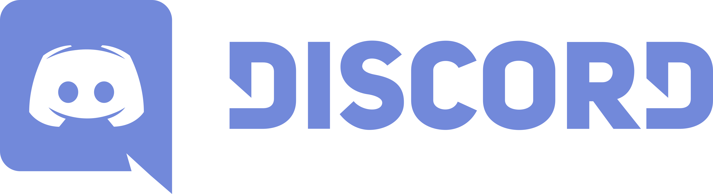

 

  

  <h1 align="center">Discord UI Clone</h1>

  

    Discord UI Clone (partial) based on a video tutorial made by <g-emoji class="g-emoji" alias="rocket" fallback-src="https://github.githubassets.com/images/icons/emoji/unicode/1f680.png">🚀</g-emoji><a href="https://www.youtube.com/watch?v=x4FdZd2-_uU&t=7846s" >Rocketseat on their youtube channel</a> for study purposes.
  

 

  

 

## Cloning User Interface of Discord Desktop

The objective of this project is to practice and improve my knowledge of Front-end development and technologies.

### Built With

* ReactJS
* Styled Components
* Typescript

### Usage

1. Run `npm install` or `yarn install`. 
2. Run `npm start` or `yarn start` and access `http://localhost:3000`. 

 

by Lucas Bicalho 
[Linkedin](https://www.linkedin.com/in/lucasbicalho/) | [GitHub](https://github.com/LucasBicalho)